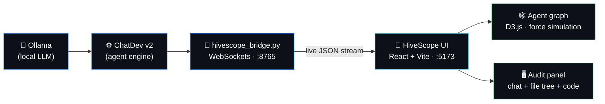

<div align="center">




<br/>

[](LICENSE)
[]()
[](CONTRIBUTING.md)
[]()

<br/>

`「 Your AI agent team works blind inside a terminal. HiveScope gives it a hive with glass walls. 」`

</div>

---

## 🔭 What is HiveScope?

**HiveScope** is an **open-source, local-first, real-time visualizer** for multi-agent AI systems.
It turns plain-text agent logs into a **living graph**: every agent is a node, every message is a
pulse of light traveling between nodes, and every generated file shows up in an IDE-style audit panel.

No cloud. No accounts. No telemetry leaving your machine. If it runs on `localhost`, HiveScope can see it.

<table>
<tr>
<td width="50%" valign="top">

### 🧠 The problem

ChatDev v2 (DevAll) dropped its classic visualizer. Frameworks like CrewAI, LangGraph, and AutoGen
ship no local UI at all. Today, understanding which agent is blocked, who is talking to whom, and
which files are being generated means **manually reading consoles and `.log` files**. Existing
observability platforms are cloud-based, heavyweight, or paid.

</td>
<td width="50%" valign="top">

### ⚡ The solution

A **single-line telemetry bridge** streams every agent event over WebSockets into a D3.js
force-directed canvas. **Non-invasive by design** — the original framework code is never modified.
First adapter: **ChatDev v2**. The adapter architecture is ready for CrewAI, LangGraph, and AutoGen.

</td>
</tr>
</table>

---

## 🗺️ Architecture



---

## ✨ Features

| | Feature | Status |
|---|---|---|
| 🕸️ | **Live D3.js graph** — self-organizing nodes via attraction/repulsion forces, zoom & drag | 🔨 Phase 1 |
| 💫 | **Message pulses** — a particle of light travels between agents on every communication | 🔨 Phase 1 |
| 🫀 | **Live node states** — nodes pulse while their agent is thinking; state changes recolor them | 🔨 Phase 1 |
| 🖥️ | **Audit panel** — cascading chat of the selected node + file tree of generated artifacts | 🔨 Phase 1 |
| 🔌 | **True Plug & Play** — `python run_with_hivescope.py` and done; zero framework modification | 🔨 Phase 1 |
| 📼 | **Replay mode** — drop a `.json` session file and replay the entire run with play/pause | 📋 Phase 2 |
| 🧩 | **Adapters** — ChatDev v2 first; CrewAI, LangGraph, and AutoGen on the roadmap | 📋 Phase 3 |
| 🔒 | **Privacy by design** — nothing leaves your machine; works fully offline | ✅ Always |

---

## 🚀 Quick start (3 steps)

```bash
# 1 · Clone and install the frontend
git clone https://github.com/RubioKo/hivescope.git
cd hivescope/frontend && npm install && npm run dev

# 2 · Attach the bridge to ChatDev v2
cp ../bridge/hivescope_bridge.py /path/to/ChatDev/
pip install websockets

# 3 · Launch your task through the wrapper (with Ollama running)
python run_with_hivescope.py "build a snake game"
# ➜ open http://localhost:5173 and watch your agents work 🔭
```

> 💡 **No ChatDev at hand?** Open the UI and hit **"View demo"** to load
> `examples/demo_session.json`, a fully synthetic sample session.

---

## 🧬 The data contract (schema v1)

Everything in HiveScope revolves around a single versioned JSON schema — identical for
real-time streaming and offline replay:

```json
{
  "schema_version": 1,
  "timestamp": "2026-07-08T14:32:00Z",
  "source": "Programmer",
  "target": "Code Reviewer",
  "phase": "Coding",
  "action": "Writing main.py",
  "message": "…",
  "files": ["main.py"],
  "status": "working"
}
```

📖 Full specification: [`docs/data-schema.md`](docs/data-schema.md)

---

## 🛣️ Roadmap

```
╭──────────────────────────────────────────────────────────────╮
│  PHASE 1 · v0.1  ▸ Real-time D3.js graph (ChatDev v2)        │
│  PHASE 2 · v0.2  ▸ Offline replay mode + syntax highlighting │
│  PHASE 3 · v0.3  ▸ Adapters: CrewAI · LangGraph · AutoGen    │
│  PHASE 4 · v0.4  ▸ Per-agent metrics (latency & tokens)      │
╰──────────────────────────────────────────────────────────────╯
```

Track progress on the [Milestones](../../milestones) page and grab a
[`good first issue`](../../labels/good%20first%20issue) to start contributing.

---

## 🤝 Contributing

HiveScope is **100% free for the community** and contributions are welcome.

1. Read the full guide: [`CONTRIBUTING.md`](CONTRIBUTING.md)
2. Review the [`Code of Conduct`](CODE_OF_CONDUCT.md)
3. Golden rule of this repo: **zero secrets, zero personal data, zero real logs** —
   every sample dataset is synthetic.

<div align="center">

| 💙 Where we need help the most |
|---|
| D3.js force-simulation performance tuning |
| Adapters for CrewAI / LangGraph / AutoGen |
| Syntax highlighting in the code panel |
| Documentation and translations |

</div>

---

<div align="center">



`⚡ Built with open source, for the open-source community.`

**[⬆ Back to top](#-what-is-hivescope)**


</div>
